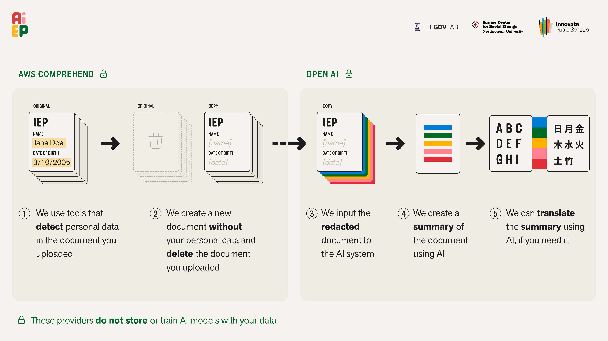
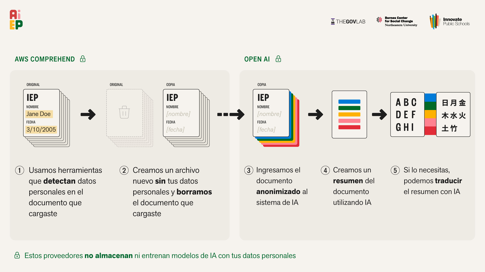

# A-IEP

**AI for Individualized Education Programs** - A serverless application that helps parents understand their child's IEP documents through AI-powered translation, simplified language, and helpful resources.

🌐 **Live Application**: [https://alpha.a-iep.org/](https://alpha.a-iep.org/)

---

## Table of Contents

1. [Project Overview](#project-overview)  
2. [Features](#features)  
3. [User Interface Preview](#user-interface-preview)  
4. [Data Privacy & Security](#data-privacy--security)  
5. [Architecture](#architecture)  
6. [Prerequisites](#prerequisites)  
7. [Getting Started](#getting-started)  
8. [Project Structure](#project-structure)  
9. [Deployment](#deployment)  
10. [Testing](#testing)  
11. [Technology Stack](#technology-stack)  
12. [Contributing](#contributing)  
13. [License](#license)  

---

## Project Overview

A-IEP is a comprehensive platform designed to make Individualized Education Program (IEP) documents more accessible to parents and families. The application uses generative AI to:

- **Process IEP documents** using OCR and AI-powered analysis
- **Translate content** into multiple languages (English, Spanish, Vietnamese, Chinese)
- **Simplify complex language** into parent-friendly summaries
- **Extract key sections** including accommodations, goals, services, and meeting notes
- **Provide educational resources** about parent rights and the IEP process
- **Generate PDFs** of processed documents for easy sharing

The platform is built as a serverless application using AWS CDK, providing a scalable, secure, and cost-effective solution for processing sensitive educational documents.

---

## Features

### Document Processing
- **Upload & Process**: Secure document upload with real-time processing status
- **OCR Extraction**: Text extraction from PDF documents using Mistral OCR API
- **PII Redaction**: Automatic removal of personally identifiable information using AWS Comprehend
- **Multi-Agent Analysis**: AI-powered extraction of summaries, sections, abbreviations, and meeting notes
- **Progress Tracking**: Real-time progress updates during document processing

### Translation & Localization
- **Multi-Language Support**: Full translation support for English, Spanish, Vietnamese, and Chinese
- **Language Preferences**: User-configurable language preferences
- **Glossary**: Educational terminology glossary with translations
- **Abbreviation Dictionary**: Centralized list of IEP abbreviations and their meanings

### User Experience
- **User Profiles**: Manage parent and child information
- **Document Management**: View, organize, and delete IEP documents
- **PDF Generation**: Generate downloadable PDFs of processed documents
- **Parent Rights Information**: Educational resources about IEP rights and processes
- **Responsive Design**: Mobile-friendly interface built with React

### Security & Privacy
- **Authentication**: AWS Cognito with email and phone/SMS verification
- **Encryption**: KMS-encrypted data at rest for S3, DynamoDB, and Lambda environment variables
- **PII Protection**: Automatic redaction of sensitive information
- **Secure Storage**: Encrypted S3 buckets for document storage

---

## User Interface Preview

The following wireframes illustrate key features of the A-IEP document viewer:

### Document Summary
AI-generated summary providing a clear, parent-friendly overview of the IEP document.


### Key Insights
Expandable insights highlighting important information from the IEP. Click on any insight to reveal detailed explanations.


### Interactive Glossary
Highlighted terms in the document can be clicked to open a glossary panel with plain-language definitions of educational terminology and abbreviations.


### Page References
Each section shows the original page numbers where information was found, making it easy to locate content in the source IEP document.


---

## Data Privacy & Security

A-IEP is designed with privacy and security at its core. The following diagram illustrates how we protect your data throughout the document processing pipeline:



<details>
<summary>Ver en español (View in Spanish)</summary>



</details>

### Security Measures

All data is encrypted both in transit (over the internet) and at rest (on our servers). We use robust encryption methods, including our own AWS Key Management Service (KMS) key, to protect your information. Personally Identifiable Information (PII) is **automatically removed before any AI processing** takes place, using AWS Comprehend. The original IEP file is immediately deleted from our storage system after processing.

### Access Controls

Our software code is private and accessible only to our core development team. User accounts are managed through Amazon Cognito, a secure identity service, and we never have access to user passwords. Any sensitive keys or secrets used by the system are securely stored and encrypted.

### Automatic PII Redaction

There is no manual process required to remove personal data. PII is automatically detected and redacted from the document before it is analyzed. Only this redacted, non-identifiable text and summaries derived from it are used in the processing pipeline.

### Accuracy & Confidentiality

- The A-IEP tool generates **draft content intended for human review**
- We do not retain original documents
- All redacted data and system logs are encrypted
- Our AI providers (OpenAI API and Mistral AI) **do not use your data to train their models**
- We support complete data deletion requests (available in the Profile Screen)

---

## Architecture

### Infrastructure Components

- **API Gateway (HTTP API)**: RESTful API endpoints for document and profile management
- **AWS Lambda**: Serverless functions for document processing, user management, and PDF generation
- **AWS Step Functions**: Orchestrates the multi-stage document processing pipeline
- **Amazon S3**: Encrypted buckets for document storage (raw and processed)
- **Amazon DynamoDB**: Tables for user profiles, IEP documents, and processing metadata
- **Amazon Cognito**: User authentication and authorization
- **Amazon CloudFront**: CDN for frontend distribution
- **AWS KMS**: Customer-managed encryption keys for data protection

### Document Processing Pipeline

The document processing workflow uses AWS Step Functions to orchestrate the following stages:

1. **Document Ingestion** (5%): Initialize processing and status tracking
2. **OCR Extraction** (15%): Extract text using Mistral OCR API
3. **PII Redaction** (20%): Remove sensitive information using AWS Comprehend
4. **File Cleanup** (22%): Delete original uploaded file
5. **AI Analysis** (65%): Parallel processing of:
   - Document parsing (summaries, sections, abbreviations, document index)
   - Meeting notes extraction
6. **Translation** (85%): Translate content to user's preferred languages (if needed)
7. **Finalization** (100%): Store structured results in DynamoDB

For detailed pipeline documentation, see [`lib/chatbot-api/functions/metadata-handler/README.md`](lib/chatbot-api/functions/metadata-handler/README.md).

---

## Prerequisites

### Required Software
- [Node.js](https://nodejs.org/) v18 or higher
- [AWS CLI](https://aws.amazon.com/cli/) configured with appropriate permissions
- [AWS CDK Toolkit](https://docs.aws.amazon.com/cdk/v2/guide/cli.html) (`npm install -g aws-cdk`)
- [Docker Desktop](https://www.docker.com/products/docker-desktop/) installed and running (required for Lambda bundling)

### AWS Account Requirements
- AWS account with permissions for:
  - CDK, IAM, SNS, Cognito, S3, DynamoDB, Lambda, Step Functions, API Gateway, CloudFront, KMS, Comprehend
- SNS SMS sandbox exit (for phone authentication)
- AWS Parameter Store access for storing API keys

### API Keys
- **OpenAI API Key**: For document analysis and translation (stored in AWS Parameter Store)
- **Mistral API Key**: For OCR processing (stored in AWS Parameter Store)

---

## Getting Started

### 1. Clone the Repository
```bash
git clone https://github.com/The-Burnes-Center/ai-iep.git
cd ai-iep
```

### 2. Install Dependencies
```bash
npm install
cd lib/user-interface/app
npm install
cd ../../..
```

### 3. Configure API Keys
Store your API keys in AWS Parameter Store:
```bash
aws ssm put-parameter --name "/ai-iep/OPENAI_API_KEY" --value "your-openai-key" --type "SecureString" --overwrite
aws ssm put-parameter --name "/ai-iep/MISTRAL_API_KEY" --value "your-mistral-key" --type "SecureString" --overwrite
```

### 4. Configure Application Settings
Update `lib/constants.ts` with your configuration:
```typescript
export const cognitoDomainName = "your-unique-domain-name"  // Must be globally unique
export const OIDCIntegrationName = ""  // Set if using SSO (leave blank if not)
export const stackName = "AIEPStack"  // Your stack name
```

### 5. Bootstrap AWS Environment
If this is your first time using CDK in this AWS account/region:
```bash
cdk bootstrap aws://<ACCOUNT_ID>/<REGION>
```

---

## Project Structure

```
ai-iep/
├── bin/                          # CDK entrypoint
│   └── gen-ai-mvp.ts
├── lib/                          # CDK TypeScript source code
│   ├── authorization/            # Cognito authentication stack
│   │   └── new-auth.ts          # User pool with email/phone auth
│   ├── chatbot-api/             # Backend API infrastructure
│   │   ├── buckets/             # S3 bucket definitions
│   │   ├── functions/           # Lambda function definitions
│   │   │   ├── metadata-handler/ # Document processing pipeline
│   │   │   │   ├── orchestrator.py
│   │   │   │   ├── ddb-service/
│   │   │   │   └── steps/       # Step Functions steps
│   │   │   ├── pdf-generator/   # PDF generation function
│   │   │   ├── user-profile-handler/ # User management
│   │   │   └── knowledge-management/ # S3 file operations
│   │   ├── gateway/             # API Gateway configuration
│   │   ├── state-machines/      # Step Functions definitions
│   │   ├── tables/              # DynamoDB table definitions
│   │   └── logging/             # CloudWatch logging setup
│   ├── user-interface/          # Frontend application
│   │   └── app/                 # React application
│   │       ├── src/
│   │       │   ├── components/  # React components
│   │       │   ├── pages/       # Page components
│   │       │   ├── common/      # Shared utilities
│   │       │   └── translations/ # i18n translation files
│   │       └── package.json
│   ├── shared/                  # Shared utilities
│   ├── constants.ts             # Application constants
│   ├── tags.ts                  # AWS resource tagging
│   └── gen-ai-mvp-stack.ts     # Main CDK stack
├── test/                        # Unit tests
├── cdk.json                     # CDK configuration
├── package.json                 # Root dependencies
└── README.md
```

### Key Modules

- **`authorization/`**: Handles user authentication with AWS Cognito, supporting email and phone/SMS verification
- **`chatbot-api/`**: Contains all backend infrastructure including API Gateway, Lambda functions, Step Functions, DynamoDB tables, and S3 buckets
- **`user-interface/`**: React-based frontend application with multi-language support
- **`shared/`**: Common utilities and helper functions used across the stack
- **`gen-ai-mvp-stack.ts`**: Main CDK stack that orchestrates all components

---

## Deployment

### Automatic Deployment

The application is configured for **automatic deployment on git push**. When you push changes to the repository, the CI/CD pipeline will:

1. Build the TypeScript CDK code
2. Build the React frontend application
3. Deploy all stacks to AWS
4. Update CloudFront distribution with new frontend build

**Note**: Do not manually run `cdk deploy` unless testing locally. The deployment is handled automatically by the CI/CD pipeline.

### Manual Deployment (Local Testing Only)

If you need to deploy manually for local testing:

1. **Build the project**:
   ```bash
   npm run build
   cd lib/user-interface/app
   npm run build
   cd ../../..
   ```

2. **Deploy all stacks**:
   ```bash
   cdk deploy --all
   ```

3. **Verify deployment**:
   - Check AWS Console for stack status
   - Verify Cognito User Pool configuration
   - Test API endpoints
   - Verify CloudFront distribution is updated

### Environment Configuration

The application supports environment-specific configurations through the `tags.ts` module. Resources are automatically tagged and named based on the environment (e.g., staging, production).

---

## Testing

### Unit Tests
Run the test suite:
```bash
npm test
```

### Frontend Development
To run the frontend locally for development:
```bash
cd lib/user-interface/app
npm run dev
```

### Testing Document Processing
1. Upload a test IEP document through the UI
2. Monitor processing progress via the document status API
3. Verify translations and summaries are generated correctly
4. Test PDF generation functionality

---

## Technology Stack

### Infrastructure
- **AWS CDK** (TypeScript): Infrastructure as Code
- **AWS Lambda**: Serverless compute (Python & Node.js)
- **AWS Step Functions**: Workflow orchestration
- **Amazon API Gateway**: REST API endpoints
- **Amazon Cognito**: User authentication
- **Amazon S3**: Document storage
- **Amazon DynamoDB**: NoSQL database
- **Amazon CloudFront**: CDN and frontend hosting
- **AWS KMS**: Encryption key management
- **AWS Comprehend**: PII detection and redaction

### Backend
- **Python 3.x**: Lambda functions for document processing
- **Node.js**: Lambda functions for API handlers and PDF generation
- **OpenAI API**: Document analysis and translation
- **Mistral API**: OCR text extraction
- **Puppeteer**: PDF generation

### Frontend
- **React 18**: UI framework
- **TypeScript**: Type-safe development
- **Vite**: Build tool and dev server
- **React Router**: Client-side routing
- **AWS Amplify**: AWS service integration
- **Bootstrap**: UI component library
- **i18next**: Internationalization

---

## Contributing

We welcome contributions! Please follow these steps:

1. **Fork the repository**
2. **Create a feature branch** (`git checkout -b feature/your-feature-name`)
3. **Make your changes** following existing code style and conventions
4. **Test your changes** thoroughly
5. **Commit your changes** (`git commit -m "Add feature: description"`)
6. **Push to your branch** (`git push origin feature/your-feature-name`)
7. **Open a Pull Request**

### Code Style Guidelines
- Follow TypeScript/JavaScript best practices
- Use meaningful variable and function names
- Add comments for complex logic
- Maintain consistent formatting
- Write unit tests for new features
- Update documentation as needed

---

## License

This work is licensed under the [Creative Commons Attribution-NonCommercial 4.0 International License](https://creativecommons.org/licenses/by-nc/4.0/deed.en).

### License Terms

You are free to:
- **Share** — copy and redistribute the material in any medium or format
- **Adapt** — remix, transform, and build upon the material

Under the following terms:
- **Attribution** — You must give appropriate credit, provide a link to the license, and indicate if changes were made
- **NonCommercial** — You may not use the material for commercial purposes

See the [full license text](LICENSE) for complete terms.

---

## Additional Resources

- **Project Website**: [https://a-iep.org/](https://a-iep.org/)
- **Document Processing Pipeline**: See [`lib/chatbot-api/functions/metadata-handler/README.md`](lib/chatbot-api/functions/metadata-handler/README.md) for detailed architecture documentation
- **User Profile Handler**: See [`lib/chatbot-api/functions/user-profile-handler/README.md`](lib/chatbot-api/functions/user-profile-handler/README.md) for API documentation
